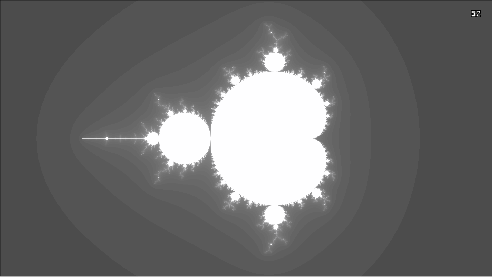
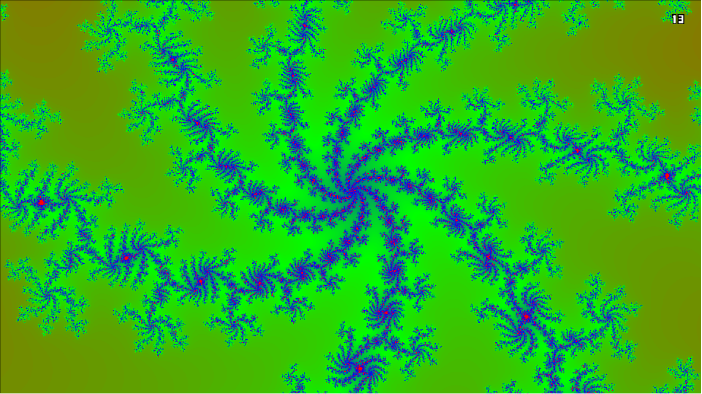

# Mandelbrot

## Фичи
Поддерживаются 4 раскраски.
В правом верхнем углу виден счётчик кадрова.

### Серая

### Серая более плавная

### Чёрно-белая

### RGB Градиент


## Управление
Стрелочки/WASD - перемещение
-/+ - зум

Q, E - смена раскраски.
X - выход.
B - выход с запуском бенчмарка.

Также можно перемещать и увеличивать с помощью
мыши, зажимая левую кнопку мыши и двигая,
а также крутя колёсико.

## Тесты производительности
Использовалось 2 реализации:

* Наивная

Здесь мы просто расчитываем каждый пиксель по формуле
множества Мандельброта.

```c++
const double xShift = (double)camera->w / 2.f;
const double yShift = (double)camera->h / 2.f;

for (int iy = 0; iy < camera->h; iy++)
{
    for (int ix = 0; ix < camera->w; ix++)
    {
        const double x0 = ((double)ix - xShift) / camera->scale - camera->x;
        const double y0 = ((double)iy - yShift) / camera->scale - camera->y;

        double x = x0, y = y0;

        int N = 0;

        for (; N < N_MAX; N++)
        {
            const double x2 = x * x;
            const double y2 = y * y;
            const double r2 = x2 + y2;

            if (r2 > R2_MAX)
                break;

            const double xy = x * y;

            x = x2 - y2 + x0;
            y = xy + xy + y0;
        }

        *(pixels + iy * camera->w + ix) = palette[N % NUMBER_OF_COLORS];
    }
}
```

* AVX512

Здесь используются AVX512 инструкции, позволяющие одновременно обрабатывать сразу по 8 пикселей
в double.

```c++
const double xShift = (double)camera->w / 2.f;
const double yShift = (double)camera->h / 2.f;

const __m512d DX = _mm512_mul_pd (_mm512_set1_pd(1 / camera->scale), DX_FACTORS);

for (int iy = 0; iy < camera->h; iy++)
{
    uint32_t* pixelsRow = pixels;
    pixels += camera->w;

    const double  y0 = ((double)iy - yShift) / camera->scale - camera->y;
    const __m512d Y0 = _mm512_set1_pd(y0);

    for (int ix = 0; ix < camera->w; ix += SIMULTANEOUS_PIXELS)
    {
        const double  x0 = ((double)ix - xShift) / camera->scale - camera->x;

        const __m512d X0 = _mm512_add_pd(_mm512_set1_pd(x0), DX);

        __m512d X = X0, Y = Y0;

        __m512i  colors        = _mm512_set1_epi32(palette[0]);
        __mmask8 notYetInfinte = 0xFF;

        for (int n = 0; n < N_MAX; n++)
        {
            __m512d X2 = _mm512_mul_pd(X, X);
            __m512d Y2 = _mm512_mul_pd(Y, Y);
            __m512d XY = _mm512_mul_pd(X, Y);

            __mmask8 cmp                 = _mm512_cmplt_pd_mask(_mm512_add_pd(X2, Y2), R2_MAX_512);
            __mmask8 pixelsToChangeColor = cmp ^ notYetInfinte; // if pixel is finite not color
            notYetInfinte               &= cmp;

            colors = _mm512_mask_set1_epi32(colors, pixelsToChangeColor, palette[n]);

            if (!cmp) break;

            X = _mm512_add_pd(_mm512_sub_pd(X2, Y2), X0);
            Y = _mm512_add_pd(_mm512_add_pd(XY, XY), Y0);
        }

        _mm512_storeu_epi32(pixelsRow, colors);
        pixelsRow += SIMULTANEOUS_PIXELS;
    }
}
```

Прогнав по 100 раз каждую генерацию кадра, без её отрисовки,
получим следующие значения тиков процессорва:

Реализация | Количество прогонов | Количество Тиков | Отношение
|:--------:|:-----------------:|:----------------:|:---------:|
Naive      |100                |63079209161       |1          |
AVX512     |100                |18761512831       |3.362      |

AVX  : 100 runs took 18761512831 ticks

Naive / AVX = 3.362